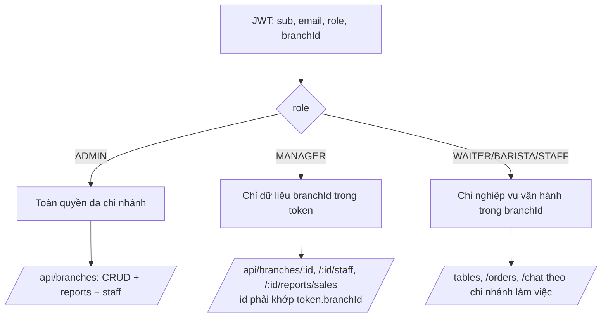
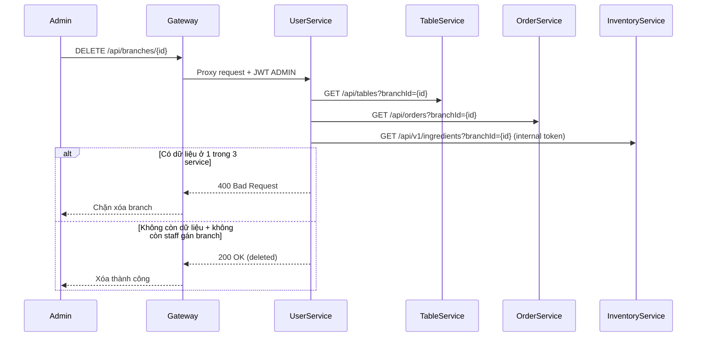
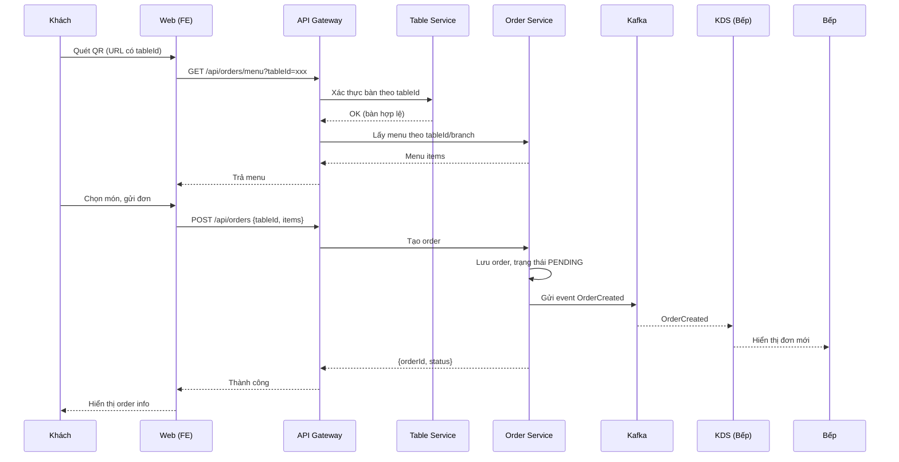
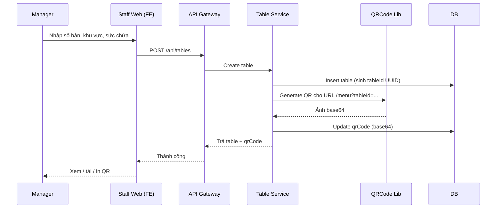
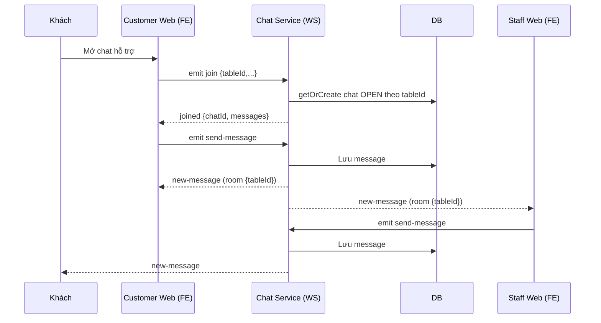
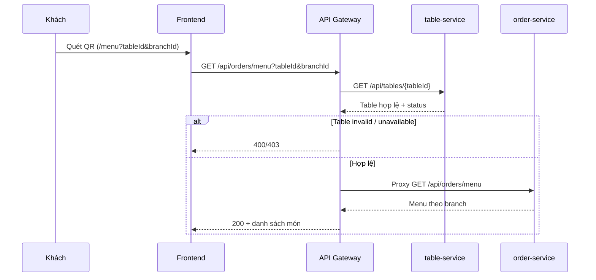
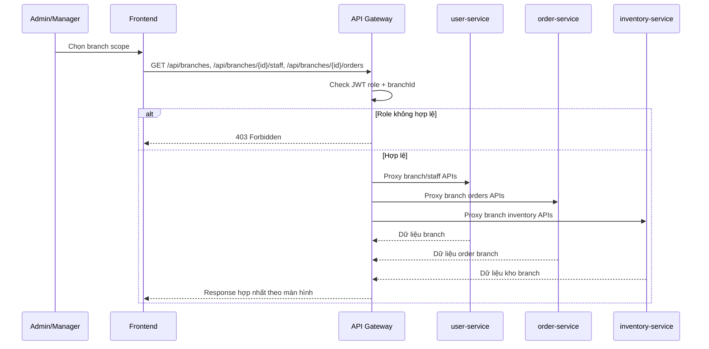
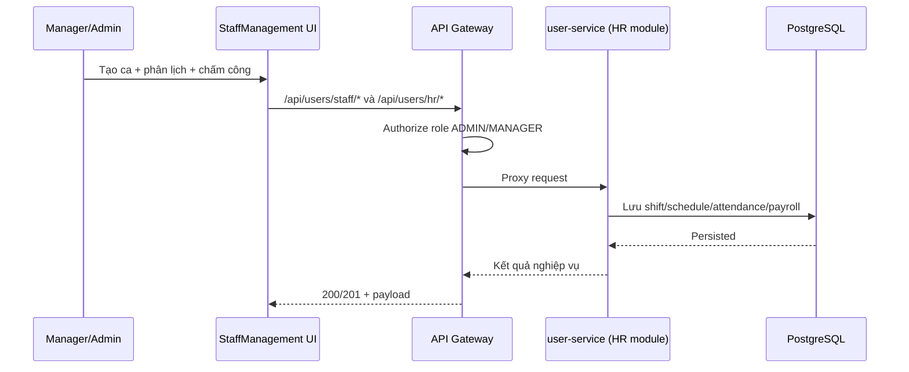
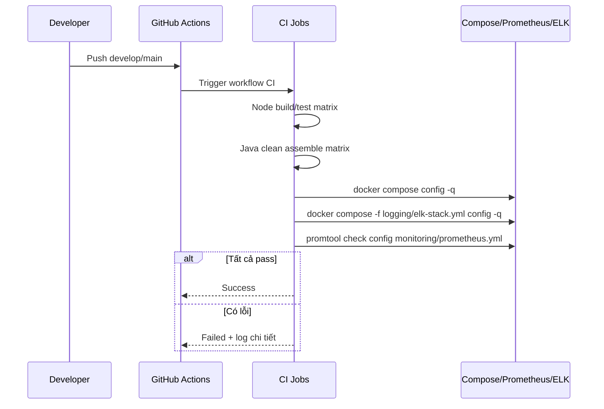

# Hệ Thống Quản Lý Quán Cà Phê (Microservices)

Hệ thống phục vụ 3 nhóm người dùng:

- Khách hàng: quét QR bàn, xem menu, đặt món, theo dõi đơn, chat hỗ trợ, thanh toán.
- Nhân viên: nhận đơn, xử lý KDS, quản lý bàn, xác nhận thanh toán tiền mặt, hỗ trợ chat.
- Quản lý/Admin: quản lý nhân sự, menu, kho, khuyến mãi, chi nhánh, báo cáo.

Trang thai du lieu dev hien tai:
- He thong dang duoc don de van hanh 1 chi nhanh duy nhat: `Chi nhanh Riverside`.

## 1. Kiến trúc hiện tại

| Service | Công nghệ runtime | Vai trò |
|---|---|---|
| `frontend` | React + Vite + Nginx | UI + reverse proxy |
| `api-gateway` | NestJS | Proxy tập trung, kiểm soát quyền theo role |
| `user-service` | Spring Boot | Auth/JWT, customer, staff, branches |
| `table-service` | Spring Boot | Quản lý bàn, QR, gọi phục vụ |
| `order-service` | NestJS + Prisma | Menu, đơn hàng, KDS, promotions |
| `chat-service` | NestJS + Socket.IO | Chat realtime theo bàn + staff notifications |
| `inventory-service` | NestJS + Prisma | Kho, nhập/xuất/kiểm kê, đồng bộ menu |
| `payment-service` | NestJS + Prisma | Thanh toán CASH/SePay |
| `report-service` | NestJS + Prisma | Báo cáo doanh thu/kho/nhân sự/dashboard |
| `postgres` | PostgreSQL | Dữ liệu chính |
| `redis` | Redis | Cache/realtime |

## 2. Cấu trúc thư mục

```text
Microservices/
├── apps/
│   ├── backend/
│   │   ├── api-gateway/
│   │   ├── user-service/
│   │   ├── table-service/
│   │   ├── order-service/
│   │   ├── chat-service/
│   │   ├── inventory-service/
│   │   ├── payment-service/
│   │   └── report-service/
│   └── frontend/
├── ops/
│   ├── docs/
│   ├── scripts/
│   └── k8s/
├── docker-compose.yml
├── .env.example
├── deploy.sh
├── seed-database.sh
└── README.md
```

## 3. Chạy hệ thống

### 3.1 Local demo (khuyen nghi)

```powershell
Copy-Item .env.local-demo.example .env -Force
.\ops\scripts\setup-local-demo.ps1
```

Truy cap:

- FE: `http://localhost`
- API qua gateway: `http://localhost:8080/api/...`
- WebSocket chat: `ws://localhost:3007/chat`

### 3.2 Chạy nhanh mặc định

```powershell
docker compose up -d --build
docker compose ps
```

Ubuntu VM: xem huong dan toi uu tai `ops/docs/ubuntu-vm-quickstart.md`.

Truy cap:

- FE: `http://localhost`
- API qua gateway: `http://localhost:8080/api/...`
- WebSocket chat: `ws://localhost:3007/chat`

### 3.3 Chạy dev (phuc vu phat trien frontend nhanh)

```bash
./deploy.sh dev
./seed-database.sh
```

Truy cập:

- FE dev port: `http://localhost:3000`
- API Gateway: `http://localhost:8080`
- Chat WS trực tiếp: `ws://localhost:3007/chat`

### 3.4 Bat stack tuy chon cung 1 compose file

```bash
docker compose --profile monitoring up -d
docker compose --profile logging up -d
```

### 3.5 Chuan bi moi truong test toan bo service

```powershell
.\ops\scripts\prepare-test-env.ps1
.\ops\scripts\run-full-api-test.ps1
```

Chi tiết test tay từng service: `ops/docs/test-services-guide.md`.

## 4. Routing API qua gateway (đúng theo code hiện tại)

Gateway nhận tất cả request `api/*` và proxy theo prefix:

- `/api/users` -> `user-service`
- `/api/tables` -> `table-service`
- `/api/orders` -> `order-service`
- `/api/chats` -> `chat-service`
- `/api/v1/ingredients` -> `inventory-service`
- `/api/v1/payments` -> `payment-service`
- `/api/reports` -> `report-service`

Một số quy tắc quyền chính ở gateway:

- Public: `POST /api/users/login`, nhóm `/api/users/customer/*`.
- Public cho luồng khách: `GET /api/orders/menu`, `POST /api/orders`, `GET /api/orders/history`, `GET /api/tables`, `GET /api/tables/{id}/qr`.
  - Với `GET /api/orders/menu` ở luồng QR khách: gateway bắt buộc kiểm tra `tableId` với `table-service` trước khi proxy sang `order-service`.
- Chỉ `ADMIN`/`MANAGER`: quản trị staff/branch, menu admin, promotions admin, reports.
- Staff role (`ADMIN|MANAGER|WAITER|BARISTA|STAFF`): profile, attendance, chat staff.
- KDS item status (`PATCH /api/orders/:id/items/:itemId/status`): `ADMIN|MANAGER|BARISTA`.
- Xác nhận cash (`POST /api/v1/payments/:paymentId/confirm-cash`): staff role phù hợp.
- Branch API alias: hỗ trợ cả `/api/users/admin/branches/*` và `/api/branches/*` (khuyến nghị dùng `/api/branches/*`).

## 5. API luồng chính (đang dùng bởi frontend)

Base URL khi chạy compose mặc định: `http://127.0.0.1:18080/api`

### 5.1 Auth / user

- `POST /users/login`
- `POST /users/register`
- `GET /users/profile`
- `POST /users/customer/request-otp`
- `POST /users/customer/register-email`
- `POST /users/customer/register-otp`
- `POST /users/customer/login-email`
- `POST /users/customer/login-otp`
- `GET /users/customer/profile`
- `GET /users/customer/offers`
- `POST /users/customer/points/accrual`
- `GET /users/staff`
- `POST /users/staff`
- `PATCH /users/staff/{id}`
- `DELETE /users/staff/{id}`
- `GET /users/staff/schedules`
- `POST /users/staff/schedules`
- `DELETE /users/staff/schedules/{id}`
- `POST /users/staff/attendance/check-in`
- `POST /users/staff/attendance/check-out`
- `GET /users/staff/attendance`
- `GET /users/staff/shift-overview`
- `GET /users/staff/payroll`
- `GET /branches`
- `GET /branches/{id}`
- `POST /branches`
- `PATCH /branches/{id}`
- `PUT /branches/{id}`
- `DELETE /branches/{id}`
- `GET /branches/{id}/staff`
- `POST /branches/{id}/staff`
- `GET /branches/{id}/reports/sales`

### 5.2 Tables + QR + gọi phục vụ

- `GET /tables`
- `GET /tables/{id}`
- `POST /tables`
- `PATCH /tables/{id}`
- `DELETE /tables/{id}`
- `PATCH /tables/{id}/status`
- `GET /tables/{id}/qr`
- `POST /tables/qr/batch`
- `POST /tables/qr/batch/download`
- `POST /tables/{id}/call-staff`

### 5.3 Orders / menu / KDS / promotions

- `GET /orders/menu`
- `POST /orders`
- `GET /orders`
- `GET /orders/history`
- `GET /orders/promotions/validate`
- `GET /orders/{id}`
- `PATCH /orders/{id}/status`
- `PATCH /orders/{id}/items`
- `PATCH /orders/{id}/customer-items`
- `PATCH /orders/{id}/items/{itemId}/status`
  - KDS item status chấp nhận cả `PREPARING` và `READY` (tương thích ngược vẫn nhận `DONE`).
- `POST /orders/table-actions/transfer`
- `GET|POST|PATCH|DELETE /orders/admin/menu/categories*`
- `GET|POST|PATCH|DELETE /orders/admin/menu/options/groups*`
- `POST /orders/admin/menu/options/groups/{groupId}/values`
- `PATCH|DELETE /orders/admin/menu/options/values/{id}`
- `GET|POST|PATCH|DELETE /orders/admin/menu/items*`
- `GET|POST|PATCH /orders/admin/promotions*`
- `POST /orders/admin/promotions/{id}/disable`

### 5.4 Chat

- REST staff:
  - `GET /chats`
  - `POST /chats`
  - `POST /chats/staff-notifications`
  - `POST /chats/{id}/messages`
  - `GET /chats/{id}/messages`
  - `PATCH /chats/{id}/close`
- WebSocket namespace:
  - `/chat` với các event `join`, `join-staff`, `send-message`.

### 5.5 Inventory / Payment / Reports

- Inventory (`/v1/ingredients`):
  - `GET /v1/ingredients`
  - `POST /v1/ingredients`
  - `PATCH /v1/ingredients/{id}`
  - `DELETE /v1/ingredients/{id}`
  - `POST /v1/ingredients/stock/import`
  - `POST /v1/ingredients/stock/receipts`
  - `POST /v1/ingredients/stock/adjust`
  - `POST /v1/ingredients/stock/export-bulk`
  - `GET /v1/ingredients/stock/movements`
  - `POST /v1/ingredients/sync-menu`
- Payment (`/v1/payments`):
  - `POST /v1/payments`
  - Provider hỗ trợ: `CASH`, `SEPAY`
  - `GET /v1/payments/orders/{orderId}`
  - `GET /v1/payments/online/qr?amount=120000&transferContent=PAY%20ORDER123`
  - `GET /v1/payments/{paymentId}`
  - `POST /v1/payments/{paymentId}/verify` (đối soát giao dịch thật trước khi chốt `PAID`)
  - `POST /v1/payments/webhook`
  - `POST /v1/payments/webhook/relay` (endpoint IPN co dinh cho SePay)
  - `GET /v1/payments/webhook/relay/events` (local pull event relay)
  - `POST /v1/payments/return`
  - `POST /v1/payments/{paymentId}/confirm-cash`
- Reports (`/reports`):
  - `GET /reports/dashboard`
  - `GET /reports/daily-stats`
  - `GET /reports/revenue`
  - `GET /reports/top-items`
  - `GET /reports/inventory`
  - `GET /reports/staff-performance`
  - `GET /reports/export`

### 5.6 Khách hàng (nâng cao: C-16..C-19)

| ID | Tên chức năng | API chính (qua `/api`) | Ghi chú bám code hiện tại |
|---|---|---|---|
| `C-16` | Đăng ký / Đăng nhập | `POST /users/customer/request-otp`, `POST /users/customer/register-otp`, `POST /users/customer/login-otp`, `POST /users/customer/register-email`, `POST /users/customer/login-email` | Hỗ trợ cả OTP số điện thoại và email. |
| `C-17` | Lịch sử đơn hàng | `GET /orders/history?customerId=...` (hoặc `email`/`phone`) | `limit` mặc định `20`, tối đa `50`. Trả về đơn theo thứ tự mới -> cũ. |
| `C-18` | Tích điểm | `GET /users/customer/profile`, `GET /users/customer/offers`, `POST /users/customer/points/accrual` | Rule hiện tại: `1 điểm = 10.000đ` (`floor(amount/10000)`). Khi đơn chuyển `COMPLETED` và có `customerId`, `order-service` gọi accrual tự động. |
| `C-19` | Gợi ý món cá nhân hóa | `GET /orders/recommendations?customerId=...` (hoặc `email`/`phone`) | Xếp hạng món theo lịch sử mua `COMPLETED` (ưu tiên gần đây), tự fallback top món phổ biến theo chi nhánh nếu chưa đủ dữ liệu lịch sử. |

### 5.7 Quản lý / Admin (M-01..M-27)

| Nhóm | Trạng thái | Bám theo code hiện tại |
|---|---|---|
| `M-01..M-03` Nhân sự / phân ca / chấm công | ✅ | `user-service` + màn `StaffManagement` |
| `M-04..M-06` Danh mục / món / tùy chọn | ✅ | `order-service` admin menu + màn `Menu` |
| `M-07..M-11` Kho / nhập hàng / kiểm kê / cảnh báo / lịch sử | ✅ | `inventory-service` + màn `Inventory` |
| `M-12..M-13` Công thức + tự động trừ kho khi món `READY` | ✅ | `order-service` phát `ItemCompleted`, `inventory-service` consume để trừ kho (fallback gọi API trực tiếp khi Kafka unavailable) |
| `M-14..M-16` Bàn + QR + in QR | ✅ | `table-service` + màn `Tables` (`/tables/{id}/qr`, `/tables/qr/batch`) |
| `M-17` Xóa / vô hiệu hóa bàn | ✅ | API đang dùng trạng thái `MAINTENANCE` (tương đương `UNAVAILABLE`) hoặc xóa cứng khi không có đơn active |
| `M-18..M-19` Khuyến mãi | ✅ | `order-service` promotions admin + màn `Promotions` |
| `M-20..M-24` Báo cáo / top món / tồn kho / hiệu suất / dashboard | ✅ | `report-service` + màn `Reports` |
| `M-25` Thêm chi nhánh | ✅ | `POST /branches` + màn `Branches` |
| `M-26` Chuyển đổi chi nhánh | ✅ | Bộ lọc chi nhánh ở header chỉ dành cho `ADMIN`; `MANAGER` bị khóa theo `branchId` trong token |
| `M-27` Cấu hình hệ thống (Admin) | ✅ (UI mức cơ bản) | Màn `Settings` có khối cấu hình SePay/webhook (`APP_BASE_URL`, `SEPAY_ENV`, `SEPAY_QUERY_URL`, `SEPAY_MERCHANT_ID`, `SEPAY_IPN_AUTH_TYPE`) và URL `POST /api/payment/webhook/sepay`. Lưu cấu hình ở localStorage; cấu hình runtime thực tế vẫn qua `.env`/deploy. |

### 5.8 Phân quyền chi nhánh (theo tài liệu)



### 5.9 Pre-check xóa chi nhánh liên service



### 5.10 Tích hợp ngoài (I-01..I-04)

| ID | Trạng thái | Ghi chú triển khai hiện tại |
|---|---|---|
| `I-01` SePay | ✅ | `payment-service` nhận provider `SEPAY`, hỗ trợ tạo giao dịch online, `return`/`webhook` và endpoint verify giao dịch thật trước khi set `PAID`. |
| `I-03` Webhook SePay | ✅ | Ho tro endpoint tuong thich `POST /payment/webhook/sepay` (qua gateway: `/api/payment/webhook/sepay`) va relay co dinh `POST /v1/payments/webhook/relay`; local pull qua `GET /v1/payments/webhook/relay/events`. |
| `I-04` Email thông báo (tùy chọn) | ✅ (mức kho) | `inventory-service` gửi email cảnh báo tồn kho thấp qua SMTP (`LOW_STOCK_ALERT_EMAILS`). |

### 5.11 Luồng Đặt Món Qua QR (Chuẩn Sequence)



Ghi chú runtime: nếu `KAFKA_BROKERS` chưa cấu hình, hệ thống fallback sang thông báo realtime trực tiếp từ `order-service` qua `chat-service` để không gián đoạn luồng đang chạy.

### 5.12 Luồng Tạo Bàn Và Sinh QR



Ghi chú bám code:
- `tableId` được sinh từ DB (`UUID`) trong `table-service`.
- QR tạo bằng ZXing và lưu trường `qrCode` dạng `data:image/png;base64,...`.
- FE hỗ trợ `GET /api/tables/{id}/qr`, `POST /api/tables/qr/batch` để tải/in dán.

### 5.13 Luồng Chat Hỗ Trợ



Ghi chú bám code:
- Room chuẩn đang dùng là `{tableId}`.
- Service vẫn join thêm room legacy `table:{tableId}` để tương thích ngược.

### 5.14 Use case mới đã triển khai (đợt gần nhất)

#### UC-01: Khách mở menu QR theo bàn/chi nhánh (gateway pre-check)



#### UC-02: Quản lý chi nhánh + lọc dữ liệu theo role/branch



#### UC-03: HRM (phân ca, chấm công, payroll)



#### UC-04: CI/CD kiểm tra hạ tầng trước deploy



## 5.15 Đối Chiếu BA Với Code (Rà soát ngày 29/05/2026)

Nguồn đối chiếu:
- `D:\L-2026\CNM\BA\pos_module_spec.md`
- `D:\L-2026\CNM\BA\invoice_module_spec.md`
- `D:\L-2026\CNM\BA\chat_module_spec.md`
- `D:\L-2026\CNM\BA\customer_menu_spec.md`
- `D:\L-2026\CNM\BA\kds_websocket_spec.md`
- `D:\L-2026\CNM\BA\order_management_spec.md`

| Module | Trạng thái bám tài liệu | Ghi chú triển khai thực tế hiện tại |
|---|---|---|
| POS (`pos_module_spec`) | ✅ Core đã chạy, 🟡 một phần phase nâng cao | Đã có sơ đồ bàn, tạo/sửa đơn, KDS, thanh toán, invoice UI, queue offline tạo order ở FE. Chưa hoàn tất các hạng mục như split bill, keyboard shortcut đầy đủ, chuyển/ghép bàn toàn phần. |
| Invoice (`invoice_module_spec`) | ✅ Triển khai chính | Đã có tạo số hóa đơn dạng `HD-YYYYMM-XXXXXX`, API xem danh sách/chi tiết/public, màn Staff Invoices và PublicInvoice, void invoice theo quyền quản lý. |
| Chat (`chat_module_spec`) | ✅ Hoạt động theo nhánh | Chat realtime đang chạy qua `chat-service` namespace `/chat`, có phân luồng theo branch cho staff notifications, lưu session + message DB, close/read và UI staff/customer. |
| Customer Menu (`customer_menu_spec`) | ✅ Core + 🟡 mở rộng | Đã có menu QR theo `tableId/branchId`, validate bàn qua gateway, cart, đặt món, login khách OTP/email, lịch sử đơn, chat, gợi ý. Có hỗ trợ cache menu và fallback khi mất mạng. |
| KDS WebSocket (`kds_websocket_spec`) | 🟡 Tương thích nghiệp vụ, chưa tách namespace chuyên biệt | Đang dùng `staff-notification` và room staff/branch để vận hành ổn định; chưa tách hoàn toàn sang giao thức `/kds` độc lập như thiết kế mục tiêu dài hạn. |
| Order Management (`order_management_spec`) | ✅ Core + 🟡 nâng cao | Đã có vòng đời order/item, đồng bộ trạng thái KDS, tích hợp tồn kho, payment hooks, branch scoping, discount validate. Một số phần advanced vẫn theo roadmap (partitioning, full event infra profile tuỳ môi trường). |

Các điểm vừa chuẩn hóa theo yêu cầu gần đây:
- Upload ảnh đại diện nhân viên bằng file (`multipart/form-data`) và lưu trực tiếp vào DB (`users.avatar_url` dạng `TEXT`).
- Upload ảnh món từ FE qua API backend và lưu chuỗi ảnh vào DB để seed/deploy có sẵn dữ liệu ảnh.
- Gateway đã thêm route cho attendance/payroll: `/api/attendance`, `/api/payroll`.
- Tách phạm vi đăng nhập theo tab/session để tránh ghi đè role giữa các tab cùng trình duyệt.
- Header hiển thị avatar thật sau khi cập nhật profile; fallback chữ cái đầu khi ảnh lỗi.
- RBAC `/staff` siết lại cho `ADMIN|MANAGER`.

## 6. Tài khoản mặc định test

| Vai trò | Email | Mật khẩu |
|---|---|---|
| Admin | `admin.test@coffeeshop.local` | `Admin@123` |
| Manager | `manager.central@coffeeshop.local` | `Manager@123` |
| Manager | `manager.riverside@coffeeshop.local` | `Manager@123` |
| Waiter | `waiter.test@coffeeshop.local` | `Waiter@123` |
| Barista | `barista.test@coffeeshop.local` | `Barista@123` |
| Barista Central | `barista.central@coffeeshop.local` | `Barista@123` |
| Staff | `staff.test@coffeeshop.local` | `Staff@123` |
| Customer | `customer.test@coffeeshop.local` | `Customer@123` |

## 7. Các URL UI quan trọng

- Frontend (compose hiện tại): `http://127.0.0.1:8088`
- API Gateway base: `http://127.0.0.1:18080/api`
- Chat WS: `ws://127.0.0.1:13007/chat`
- Login: `http://127.0.0.1:8088/login`
- Dashboard: `http://127.0.0.1:8088/`
- Tables: `http://127.0.0.1:8088/tables`
- Orders: `http://127.0.0.1:8088/orders`
- Menu management: `http://127.0.0.1:8088/menu-management`
- Inventory: `http://127.0.0.1:8088/inventory`
- Promotions: `http://127.0.0.1:8088/promotions`
- Reports: `http://127.0.0.1:8088/reports`
- Kitchen: `http://127.0.0.1:8088/kitchen`
- Staff chat: `http://127.0.0.1:8088/chat`
- Staff management: `http://127.0.0.1:8088/staff`
- Branches: `http://127.0.0.1:8088/branches`
- Customer menu: `http://127.0.0.1:8088/menu?tableId=<TABLE_ID>&branchId=<BRANCH_ID>`

## 8. Tài liệu liên quan (đã giảm trùng lặp)

- Deployment tóm tắt (dev/prod + k8s): [ops/docs/deployment-guide.md](ops/docs/deployment-guide.md)
- Nghiệm thu: [ops/docs/ACCEPTANCE_GUIDE.md](ops/docs/ACCEPTANCE_GUIDE.md)
- Hướng dẫn test từng service: [ops/docs/test-services-guide.md](ops/docs/test-services-guide.md)
- Kiến trúc: [ops/docs/architecture.md](ops/docs/architecture.md)
- Checklist bàn giao: [ops/docs/DELIVERABLES.md](ops/docs/DELIVERABLES.md)
- Postman collection: [ops/docs/api/coffee-shop.postman_collection.json](ops/docs/api/coffee-shop.postman_collection.json)
- NFR readiness (4.1-4.6): [reports/nfr/non-functional-readiness.md](reports/nfr/non-functional-readiness.md)

## 9. Lỗi thường gặp

### `docker compose ps` không kết nối daemon

- Docker Desktop chưa chạy.
- Mở Docker Desktop và chờ `Engine running`.

### Không truy cập được FE/API trên localhost

- Kiểm tra lại port map trong `docker-compose.yml`.
- Compose hiện tại dùng `http://127.0.0.1:8088` (FE) và `http://127.0.0.1:18080/api` (Gateway).

### Quét QR trên điện thoại bị lỗi

- Điện thoại và máy host phải cùng mạng LAN.
- QR cần được tạo lại nếu đổi domain/IP.

## 10. Demo Trên Ubuntu VM + Cloudflare Tunnel

Mục này thay cho `README-server.md` cũ, dùng khi demo public từ máy ảo Ubuntu.

### 10.1 Clone và chạy đúng thư mục

```bash
cd ~
git clone -b develop git@github.com:hoanggiakz/coffe-shop.git
cd coffe-shop/Microservices
cp .env.example .env
```

### 10.2 Cấu hình `.env` cho URL public

Thay `<YOUR-TUNNEL-DOMAIN>` bằng URL tunnel thật:

```env
APP_BASE_URL=https://<YOUR-TUNNEL-DOMAIN>
ALLOWED_ORIGINS=https://<YOUR-TUNNEL-DOMAIN>,https://localhost
VITE_WS_URL=https://<YOUR-TUNNEL-DOMAIN>
NEXT_PUBLIC_API_URL=https://<YOUR-TUNNEL-DOMAIN>
NEXT_PUBLIC_WS_URL=https://<YOUR-TUNNEL-DOMAIN>
ONLINE_PAYMENT_QR_URL=https://<YOUR-TUNNEL-DOMAIN>/sepay-qr.png
```

Luu y:
- Khong commit `.env` len git.
- `.env.example` chi de placeholder (`your-public-domain`), khong de URL tunnel that.
- Truoc khi run production, thay toan bo bien `CHANGE_ME_*` trong `.env`.

### 10.3 Build và chạy stack

```bash
docker compose config -q
docker compose up -d --build
docker compose ps
```

### 10.4 Chạy Cloudflare Quick Tunnel

```bash
cloudflared tunnel --url http://localhost
```

Giữ terminal tunnel luôn mở trong lúc demo.

### 10.5 Khi URL tunnel đổi

1. Sửa lại các biến URL trong `.env` như mục 10.2  
2. Rebuild service liên quan:

```bash
docker compose up -d --build frontend api-gateway table-service payment-service
```

3. Regenerate QR bàn:

```bash
curl -k -X POST https://localhost/api/tables/qr/batch -H "Content-Type: application/json" -d "{}"
```

### 10.6 Kiểm tra luồng QR order

Lấy `tableId` thật:

```bash
curl -k https://localhost/api/tables
```

Test menu:

```bash
curl -k "https://localhost/api/orders/menu?tableId=<TABLE_ID>"
curl "https://<YOUR-TUNNEL-DOMAIN>/api/orders/menu?tableId=<TABLE_ID>"
```

Kỳ vọng: cả 2 trả `200` và có danh sách món.

### 10.7 SePay relay endpoint (nếu dùng)

- IPN public cố định: `POST /api/v1/payments/webhook/relay`
- Pull event: `GET /api/v1/payments/webhook/relay/events`

Chi tiết xem thêm: [docs/sepay-webhook-relay.md](docs/sepay-webhook-relay.md)

### 10.8 SePay direct webhook (Model A)

- Huong dan setup production direct webhook:
  [ops/docs/sepay-model-a-setup.md](ops/docs/sepay-model-a-setup.md)

## 11. AI Implementation Changelog

### 11.1 Data Foundation
- Da chuan hoa schema AI trong `report-service`:
  - `sales_forecast`
  - `item_recommendation`
  - `anomaly_alert`
  - `sentiment_analysis`
  - `chatbot_query_log`
  - `ai_audit_log`
- Da them readiness check script:
  - `apps/backend/report-service/scripts/ai-data-readiness-check.mjs`
- Da bo sung seed script de dat nguong:
  - `ops/scripts/seed-ai-readiness-orders.sql`
  - `ops/scripts/seed-ai-readiness-payments.sql`
- Ket qua readiness hien tai: pass `>=3 thang`, pass `>=1000 orders/branch`, pass `branchId consistency`, pass `timezone alignment`, pass `order/payment consistency`.

### 11.2 AI Service + Gateway
- Da tao `ai-service` (FastAPI): `apps/backend/ai-service`.
- Da expose du contract `/api/ai/*` cho 5 nhom:
  - Forecast
  - Recommend
  - Anomalies
  - Sentiment
  - Chatbot
- Da map route qua gateway:
  - Them prefix `/api/ai`
  - Them `AI_SERVICE_URL`
  - RBAC: `ADMIN|MANAGER` cho endpoint AI (health public GET).

### 11.3 AI Infra Profile
- Da them profile `ai` trong `docker-compose.yml` gom:
  - Kafka + Zookeeper
  - Kafka Connect (Debezium)
  - Airflow
  - MLflow
  - Feast feature server
  - TimescaleDB
  - ClickHouse
- Da them Feast config: `ops/feast/feature_store.yaml`.
- Da them Airflow DAG + job skeleton cho chuoi:
  - ingest CDC -> dbt transform -> materialize features -> inference/retrain -> register -> deploy -> rollback guard -> retention cleanup.

### 11.4 Security, Governance, Monitoring
- Da them anonymization script:
  - `ops/scripts/anonymize-training-data.mjs`
- Da them SQL guardrail chatbot (read-only + timeout + row limit) trong `ai-service`.
- Da them audit log AI va chatbot query log.
- Da them metrics `/metrics` cho `ai-service`.
- Da them Prometheus alert rules AI:
  - high error rate
  - high p95 latency
  - stale data freshness
  - high prediction error.

### 11.5 CI/CD + E2E
- Da them CI Python cho `ai-service`:
  - lint (`ruff`)
  - type check (`mypy`)
  - tests (`pytest`)
- Da them migration checks (`prisma validate`) va image scan (`Trivy`).
- Da them E2E contract test qua gateway:
  - `ops/scripts/test-ai-contract.mjs`
  - Job CI `e2e-ai-contract` tu dong chay tren `develop`.

### 11.6 Frontend Adoption
- Da them khoi `AI Insights` trong trang Reports:
  - hien thi forecast/anomaly/sentiment tom tat
  - fallback UX khi AI service khong kha dung.
