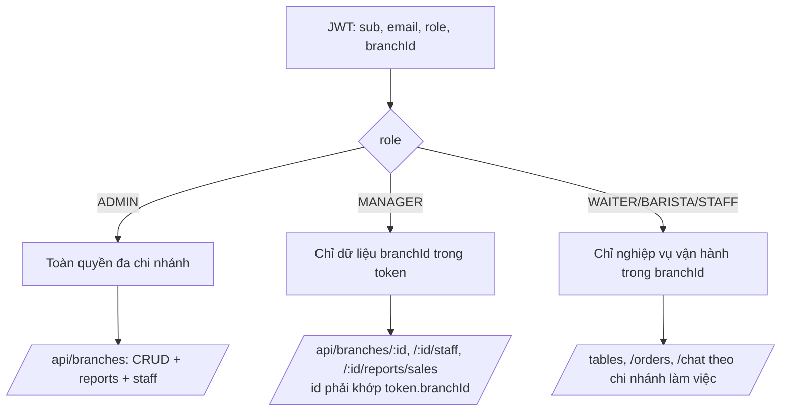
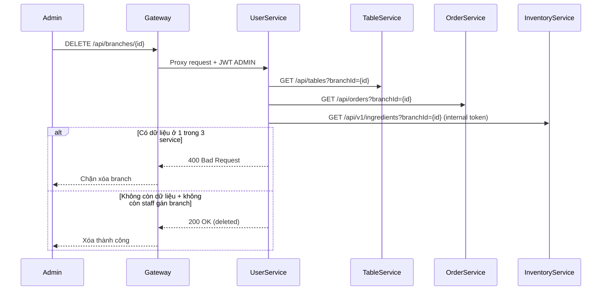

# Quản Lý Chi Nhánh Và Phân Quyền (BA/SRS)

Tài liệu này trích riêng phần chi nhánh từ hệ thống Coffee Shop Manager, bám theo yêu cầu BA và code hiện tại.

## 1. Mục tiêu

- Quản lý nhiều chi nhánh độc lập dữ liệu.
- Xác định đúng `branchId` cho đơn hàng qua QR hoặc token nhân viên.
- Phân quyền truy cập dữ liệu theo vai trò và phạm vi chi nhánh.
- Chặn xóa chi nhánh khi còn dữ liệu liên quan.

## 2. Mô hình dữ liệu liên quan

### 2.1 `branches`

- `id`: UUID, khóa chính.
- `code`: mã chi nhánh (duy nhất, bắt buộc, ví dụ `HN01`).
- `name`: tên chi nhánh.
- `address`, `phone`.
- `manager_id`: tham chiếu user quản lý.
- `is_active`, `created_at`, `updated_at`.

### 2.2 `users`

- Có trường `branch_id` để gắn nhân sự về chi nhánh.
- `ADMIN` có thể `branch_id = null`.
- `MANAGER/BARISTA/WAITER/STAFF` làm việc theo `branch_id`.

### 2.3 `orders`

- Đơn hàng lưu `branchId`.
- Nguồn xác định `branchId`:
- Từ QR (`branchId` + `tableId`).
- Từ token nhân viên khi thao tác nội bộ.

## 3. JWT Và Scope Chi Nhánh

Payload JWT (rút gọn):

```json
{
  "sub": "user-uuid",
  "email": "manager@branch.com",
  "role": "MANAGER",
  "branchId": "branch-uuid"
}
```

## 4. API Quản Lý Chi Nhánh

Base qua gateway: `/api`

- `GET /branches` (ADMIN)
- `GET /branches/{id}` (ADMIN/MANAGER theo scope)
- `POST /branches` (ADMIN)
- `PATCH /branches/{id}` (ADMIN)
- `PUT /branches/{id}` (ADMIN)
- `DELETE /branches/{id}` (ADMIN, có pre-check liên service)
- `GET /branches/{id}/staff` (ADMIN/MANAGER theo scope)
- `POST /branches/{id}/staff` (ADMIN/MANAGER theo scope)
- `GET /branches/{id}/reports/sales` (ADMIN/MANAGER theo scope)

Ghi chú tương thích:
- Hệ thống vẫn hỗ trợ alias cũ `/api/users/admin/branches/*`.
- Khuyến nghị BA/SRS dùng chuẩn mới `/api/branches/*`.

## 5. Quy tắc phân quyền

- `ADMIN`: toàn quyền đa chi nhánh.
- `MANAGER`: chỉ dữ liệu chi nhánh của chính họ (`token.branchId`).
- `WAITER/BARISTA/STAFF`: chỉ nghiệp vụ vận hành trong chi nhánh.



## 6. Pre-check khi xóa chi nhánh

Trước khi xóa branch, hệ thống kiểm tra:

1. Còn bàn trong `table-service`?
2. Còn đơn hàng trong `order-service`?
3. Còn nguyên liệu/tồn kho trong `inventory-service`?
4. Còn nhân sự gán `branch_id`?

Nếu còn dữ liệu ở bất kỳ mục nào -> trả `400`, từ chối xóa.



## 7. Mapping UI Theo Vai Trò

- `ADMIN`:
- Có màn quản lý chi nhánh.
- Có thể chọn/switch chi nhánh để xem dữ liệu vận hành.
- `MANAGER`:
- Không switch đa chi nhánh.
- Chỉ thấy dữ liệu chi nhánh được gán.
- `WAITER/BARISTA/STAFF`:
- Dùng các màn vận hành theo scope chi nhánh.

## 8. Trạng thái triển khai

- Đã triển khai đầy đủ API nhánh theo chuẩn `/api/branches`.
- Đã có JWT claim `branchId`.
- Đã áp dụng scope cho `MANAGER`.
- Đã có pre-check liên service trước khi xóa chi nhánh.
