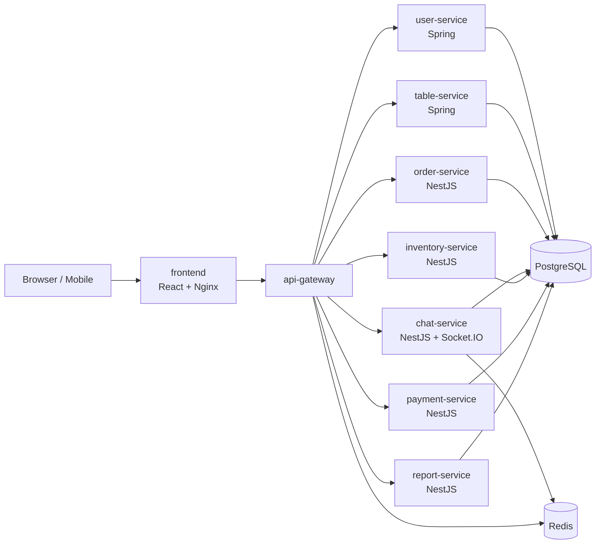
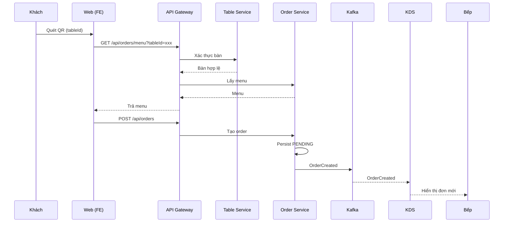

# Coffee Shop Microservices Architecture

## 1) Topology

## 2) Gateway route map

- `/api/users` -> `user-service`
- `/api/tables` -> `table-service`
- `/api/orders` -> `order-service`
- `/api/chats` -> `chat-service`
- `/api/v1/ingredients` -> `inventory-service`
- `/api/v1/payments` -> `payment-service`
- `/api/reports` -> `report-service`

## 3) Main business flows

### Order/KDS flow

1. FE gọi `GET /api/orders/menu?tableId=...` qua gateway.
2. Gateway xác thực `tableId` với `table-service` trước khi chuyển tiếp.
3. `order-service` trả menu theo `tableId` (moi truong hien tai van hanh 1 chi nhanh Riverside).
4. FE tạo đơn `POST /api/orders`.
5. `order-service` lưu order `PENDING`, publish `OrderCreated` lên Kafka.
6. KDS nhận thông báo đơn mới và hiển thị cho bếp.

Ghi chú: khi `KAFKA_BROKERS` chưa bật, hệ thống dùng đường fallback realtime (`order-service` -> `chat-service` -> `staff:global`) để giữ nguyên trải nghiệm vận hành.

### Chat flow

1. Client connect Socket.IO namespace `/chat`.
2. `chat-service` tạo/ghép session theo `tableId`.
3. Message được lưu DB và broadcast tới room `table:<tableId>`.
4. Staff nhận notification qua room `staff:global`.

### Payment flow

1. FE tạo payment qua `/api/v1/payments`.
2. `payment-service` xử lý CASH hoặc online QR.
3. Staff xác nhận tiền mặt qua `/confirm-cash`.
4. SePay IPN đi qua relay co dinh `/api/v1/payments/webhook/relay`.
5. Local payment-service pull event qua `/api/v1/payments/webhook/relay/events` de doi soat va map `PAID`.
6. Kết quả payment được dùng cho reporting.

### Inventory flow

1. Manager thao tác nhập/xuất/điều chỉnh nguyên liệu.
2. `inventory-service` ghi stock movements.
3. Khi bật Kafka (`KAFKA_BROKERS`), consumer xử lý `ItemCompleted` để trừ kho tự động.
