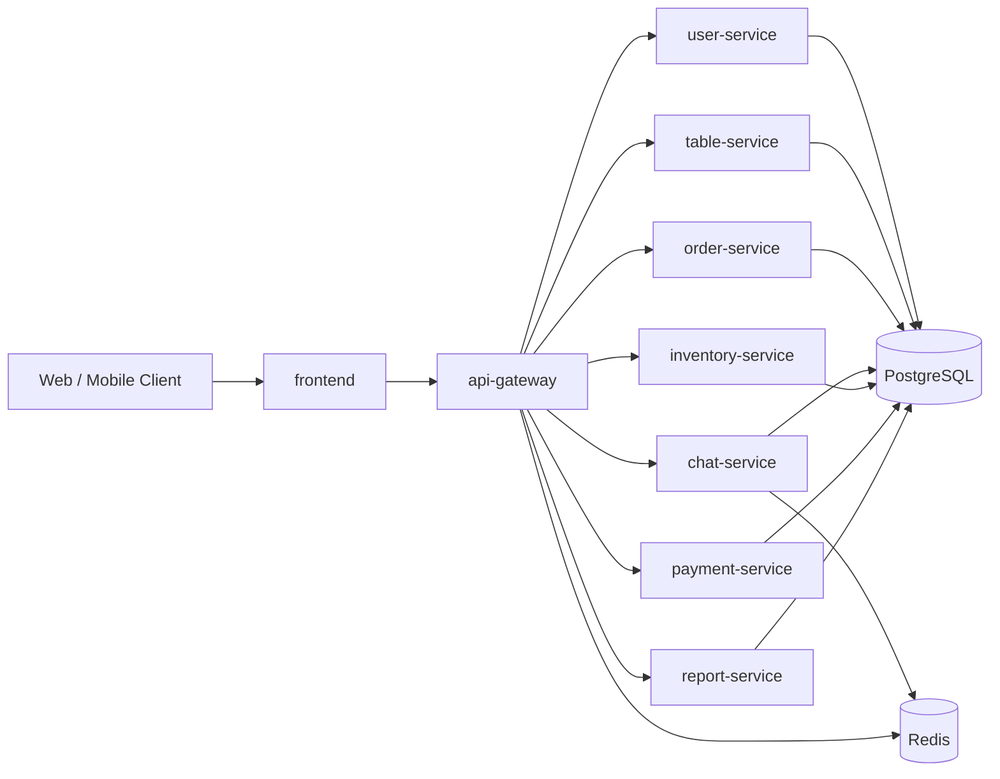

# Coffee Shop Microservices Architecture

## 1. Service topology

## 2. Main data flows

### Order flow
1. Customer selects table and menu from frontend.
2. Request goes to `api-gateway`, then `order-service`.
3. `order-service` stores order and order items in PostgreSQL.
4. Staff updates item status (KDS) through `order-service`.
5. When item completed, inventory deduction is triggered using seeded menu recipe.

### Chat flow
1. Customer/staff connects Socket.IO namespace `/chat`.
2. Chat session metadata and messages are saved by `chat-service`.
3. Redis is used for realtime fan-out / adapter.

### Payment flow
1. Frontend creates payment request through gateway.
2. `payment-service` processes method (cash / gateway provider).
3. Payment state is persisted and can be reported by `report-service`.

